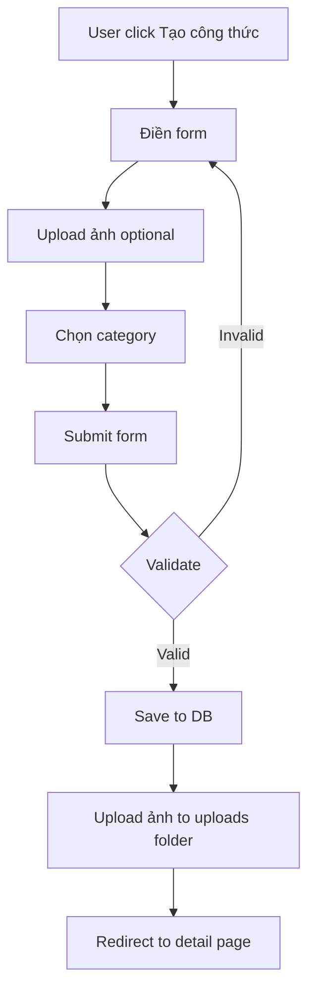
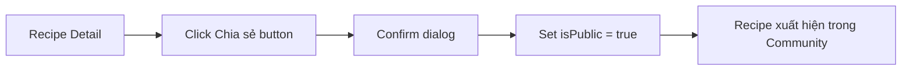
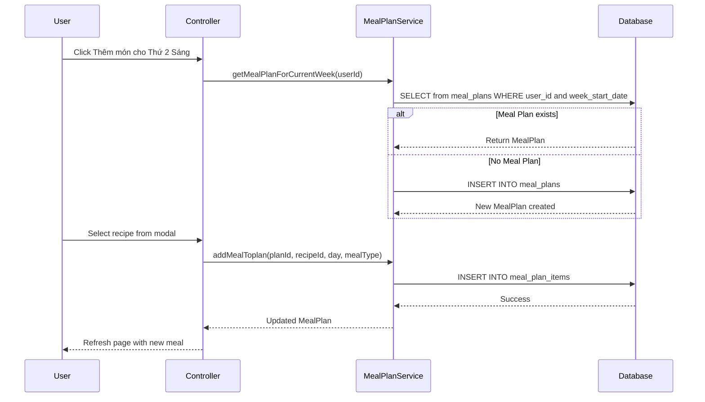
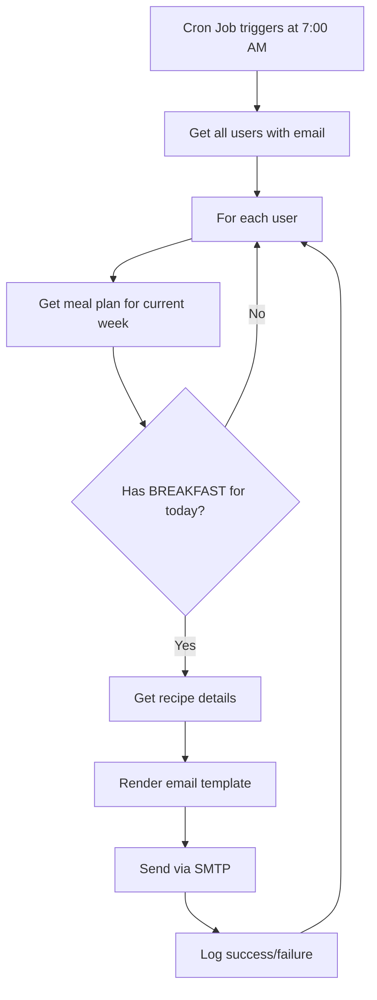
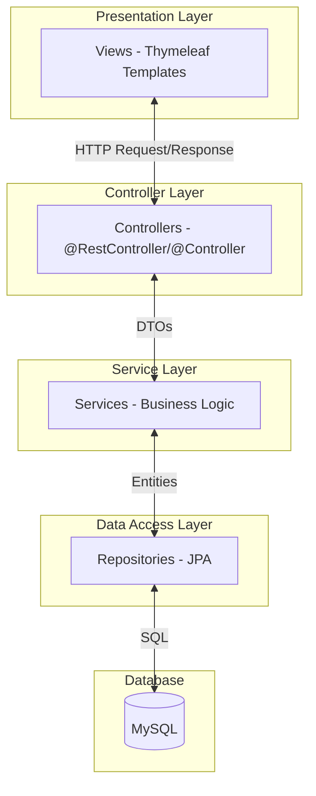
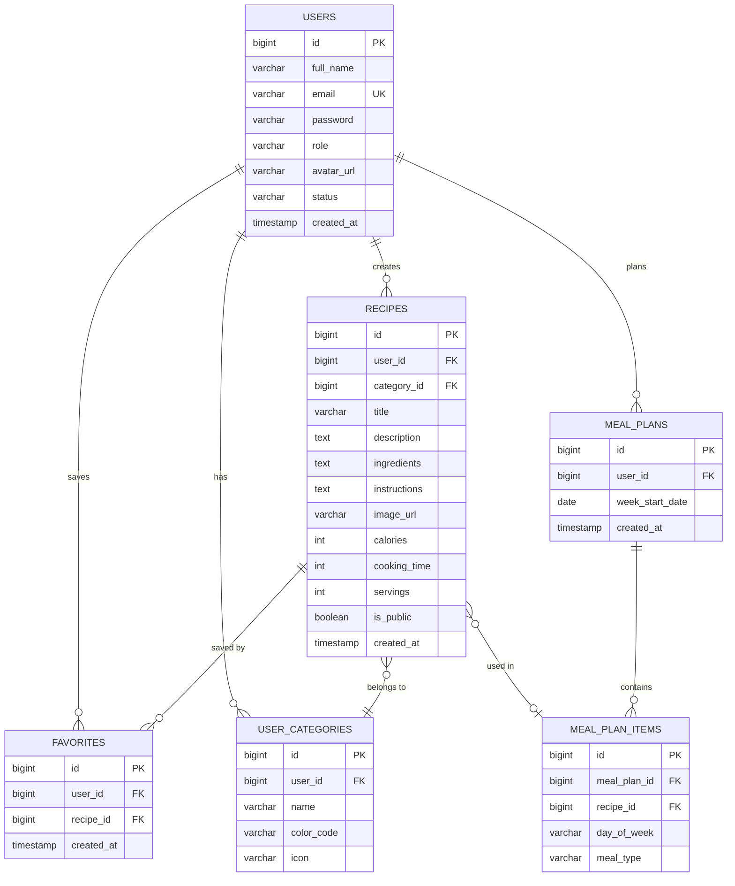
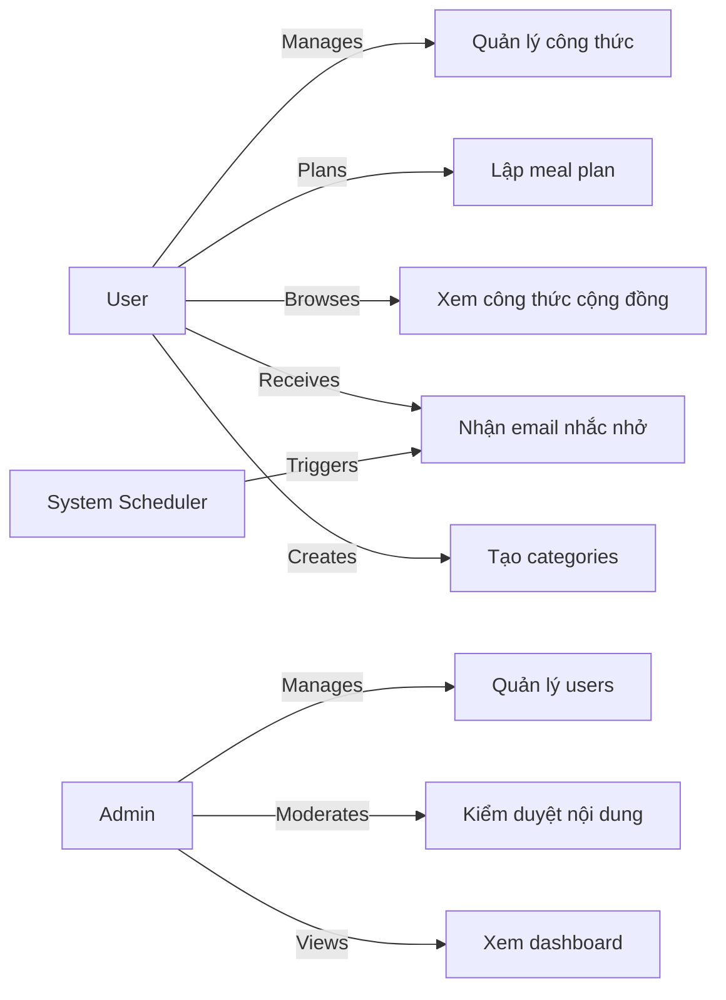
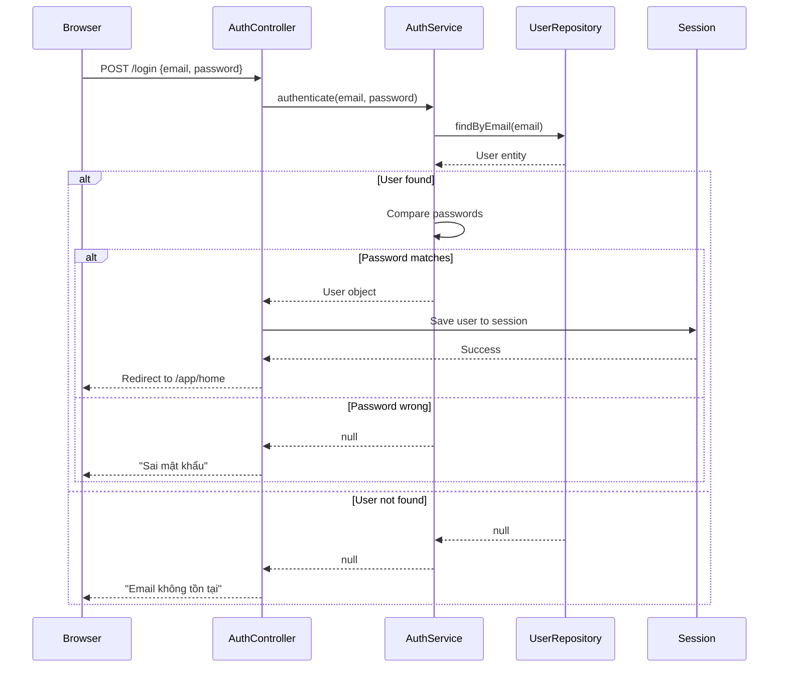

# Báo Cáo Phân Tích Hệ Thống - Recipe Discovery

**Phiên bản:** 1.0  
**Ngày:** 29/12/2025  
**Người thực hiện:** Thái Sinh Gia Bảo

---

## 📋 MỤC LỤC

1. [Phát Biểu Bài Toán](#1-phát-biểu-bài-toán)
2. [Tổng Quan Hệ Thống](#2-tổng-quan-hệ-thống)
3. [Phân Tích Chức Năng](#3-phân-tích-chức-năng)
   - 3.1. [Chức Năng Chính](#31-chức-năng-chính)
   - 3.2. [Chức Năng Phụ](#32-chức-năng-phụ)
4. [Yêu Cầu Phi Chức Năng](#4-yêu-cầu-phi-chức-năng)
5. [Kiến Trúc Hệ Thống](#5-kiến-trúc-hệ-thống)
6. [Mô Hình Dữ Liệu](#6-mô-hình-dữ-liệu)
7. [Use Case Diagrams & Workflows](#7-use-case-diagrams--workflows)
8. [Mapping Chức Năng - Files](#8-mapping-chức-năng---files)
9. [Công Nghệ Sử Dụng](#9-công-nghệ-sử-dụng)

---

## 1. PHÁT BIỂU BÀI TOÁN

### 1.1. Bối Cảnh

Trong thời đại hiện đại, việc duy trì lối sống lành mạnh và quản lý dinh dưỡng hàng ngày đang trở nên quan trọng hơn bao giờ hết. Tuy nhiên, nhiều người gặp khó khăn trong việc:

- Tìm kiếm và lưu trữ công thức nấu ăn phù hợp
- Lập kế hoạch bữa ăn hàng tuần
- Tính toán lượng dinh dưỡng và calories
- Chia sẻ công thức với cộng đồng
- Quản lý nguyên liệu và thời gian nấu

### 1.2. Mục Tiêu Hệ Thống

**Recipe Discovery** là một nền tảng web application nhằm:

1. **Quản lý công thức nấu ăn cá nhân**: Cho phép users tạo, lưu trữ, chỉnh sửa và tổ chức công thức riêng của mình
2. **Chia sẻ cộng đồng**: Kết nối users thông qua việc chia sẻ công thức và khám phá món ăn mới
3. **Lập kế hoạch bữa ăn**: Hỗ trợ lập lịch meal plan theo tuần với các bữa sáng, trưa, phụ, tối
4. **Thông báo tự động**: Gửi email nhắc nhở về bữa ăn đã lên lịch
5. **Quản lý dinh dưỡng**: Tính toán và theo dõi calories, thời gian nấu, khẩu phần

### 1.3. Đối Tượng Sử Dụng

- **Users (Người dùng thông thường)**: Quản lý công thức cá nhân, lập meal plan, tham gia cộng đồng
- **Admins (Quản trị viên)**: Quản lý users, kiểm duyệt nội dung community, xem thống kê

---

## 2. TỔNG QUAN HỆ THỐNG

### 2.1. Thống Kê Codebase

```
📊 Tổng số thành phần:
├── Controllers:     10 files
├── Services:        6 files
├── Repositories:    5 files
├── Models:          5 files
├── DTOs:            4 files
├── Templates:       17 files (HTML)
├── Schedulers:      1 file
└── Interceptors:    1 file
```

### 2.2. Cấu Trúc Package

```
com.example.recipediscovery/
├── controller/
│   ├── admin/           # Admin management
│   ├── auth/            # Authentication
│   └── user/            # User features
├── service/             # Business logic
├── repository/          # Data access
├── model/               # Entities
├── dto/                 # Data transfer objects
├── scheduler/           # Background tasks
├── interceptor/         # Request interceptors
└── config/              # Configurations
```

---

## 3. PHÂN TÍCH CHỨC NĂNG

### 3.1. Chức Năng Chính

#### 🔐 **F1. Quản Lý Người Dùng & Xác Thực**

**Mô tả:** Hệ thống authentication và authorization cho users

**Sub-features:**
- F1.1. Đăng ký tài khoản mới
- F1.2. Đăng nhập/Đăng xuất
- F1.3. Quản lý profile (avatar, thông tin cá nhân)
- F1.4. Phân quyền (USER/ADMIN)

**Files liên quan:**
```
Controllers:
├── AuthController.java              # Đăng nhập, đăng ký
└── UserController.java               # Profile management

Services:
├── AuthService.java                  # Authentication logic
└── UserService.java                  # User management

Repositories:
└── UserRepository.java               # User data access

Models:
└── User.java                         # User entity

Templates:
├── auth/login.html                   # Login page
└── auth/register.html                # Register page
```

---

#### 🍳 **F2. Quản Lý Công Thức Cá Nhân**

**Mô tả:** Users có thể tạo, xem, sửa, xóa công thức nấu ăn riêng

**Sub-features:**
- F2.1. Tạo công thức mới (tiêu đề, mô tả, nguyên liệu, hướng dẫn, ảnh)
- F2.2. Xem danh sách công thức cá nhân (pagination, search)
- F2.3. Xem chi tiết công thức
- F2.4. Chỉnh sửa công thức
- F2.5. Xóa công thức
- F2.6. Upload ảnh món ăn
- F2.7. Phân loại công thức theo category

**Files liên quan:**
```
Controllers:
└── UserRecipeController.java         # Recipe CRUD operations

Services:
└── RecipeService.java                # Recipe business logic

Repositories:
└── RecipeRepository.java             # Recipe data access

Models:
└── Recipe.java                       # Recipe entity

Templates:
├── user/home.html                    # Recipe list page
├── user/recipe-form.html             # Create/Edit form
└── user/recipe-detail.html           # Detail view

DTOs:
└── RecipeDTO.java                    # Recipe data transfer
```

**Workflow F2.1 - Tạo Công Thức Mới:**



---

#### 👥 **F3. Cộng Đồng Chia Sẻ Công Thức**

**Mô tả:** Platform cho phép users chia sẻ và khám phá công thức từ cộng đồng

**Sub-features:**
- F3.1. Đánh dấu công thức là "Public" để chia sẻ
- F3.2. Xem công thức cộng đồng
- F3.3. Tìm kiếm công thức theo keyword
- F3.4. Lưu công thức yêu thích
- F3.5. Admin kiểm duyệt nội dung

**Files liên quan:**
```
Controllers:
├── CommunityController.java          # Community features
└── AdminCommunityController.java     # Admin moderation

Templates:
├── user/community-home.html          # Community page
├── admin/community/list.html         # Admin moderation list
└── admin/community/detail.html       # Moderation detail

Models:
├── Recipe.java                       # isPublic field
└── Favorite.java                     # Favorites tracking
```

**Workflow F3.1 - Chia Sẻ Công Thức:**



---

#### 📅 **F4. Kế Hoạch Bữa Ăn (Meal Plan)**

**Mô tả:** Users lập kế hoạch bữa ăn theo tuần

**Sub-features:**
- F4.1. Tạo meal plan cho tuần hiện tại
- F4.2. Thêm công thức vào các khung giờ (BREAKFAST, LUNCH, SNACK, DINNER)
- F4.3. Xem meal plan theo ngày trong tuần
- F4.4. Xóa món ăn khỏi meal plan
- F4.5. Cập nhật meal plan

**Files liên quan:**
```
Controllers:
└── MealPlanController.java           # Meal plan management

Services:
└── MealPlanService.java              # Meal plan logic

Repositories:
├── MealPlanRepository.java           # Meal plan data
└── MealPlanItemRepository.java       # Individual meal items

Models:
├── MealPlan.java                     # Weekly plan
└── MealPlanItem.java                 # Individual meal

Templates:
└── user/meal-plan.html               # Meal plan page

DTOs:
└── MealPlanDTO.java                  # Meal plan data transfer
```

**Database Schema:**
```sql
meal_plans:
- id (PK)
- user_id (FK)
- week_start_date
- created_at

meal_plan_items:
- id (PK)
- meal_plan_id (FK)
- recipe_id (FK, nullable)
- day_of_week (MONDAY-SUNDAY)
- meal_type (BREAKFAST, LUNCH, SNACK, DINNER)
- created_at
```

**Workflow F4.2 - Thêm Món Vào Meal Plan:**



---

#### 📧 **F5. Thông Báo Email Tự Động**

**Mô tả:** Gửi email nhắc nhở về bữa ăn đã lên lịch

**Sub-features:**
- F5.1. Scheduler chạy 4 lần/ngày (7h, 11h, 15h, 17h)
- F5.2. Gửi email cho users có món trong meal plan
- F5.3. Email template đẹp với thông tin món ăn
- F5.4. Sử dụng Gmail SMTP

**Files liên quan:**
```
Services:
└── EmailService.java                 # Email sending logic

Schedulers:
└── MealPlanNotificationScheduler.java # Cron jobs

Templates:
└── emails/meal-notification-email.html # Email template

Config:
└── application.yml                   # SMTP configuration
```

**Workflow F5 - Email Notification:**



**Cron Schedule:**
```java
@Scheduled(cron = "0 0 7 * * ?")   // 07:00 - BREAKFAST
@Scheduled(cron = "0 0 11 * * ?")  // 11:00 - LUNCH  
@Scheduled(cron = "0 0 15 * * ?")  // 15:00 - SNACK
@Scheduled(cron = "0 0 17 * * ?")  // 17:00 - DINNER
```

---

#### 🏷️ **F6. Quản Lý Categories**

**Mô tả:** Users tạo và quản lý categories tùy chỉnh

**Sub-features:**
- F6.1. Tạo category mới (tên, màu, icon)
- F6.2. Xem danh sách categories
- F6.3. Chỉnh sửa category
- F6.4. Xóa category
- F6.5. Gán category cho công thức

**Files liên quan:**
```
Controllers:
└── UserCategoryController.java       # Category CRUD

Services:
└── UserCategoryService.java          # Category logic

Repositories:
└── UserCategoryRepository.java       # Category data

Models:
└── UserCategory.java                 # Category entity

Templates:
├── user/category-manage.html         # List categories
└── user/category-form.html           # Create/Edit form
```

---

#### 🔧 **F7. Quản Trị Hệ Thống (Admin)**

**Mô tả:** Admin quản lý users và kiểm duyệt nội dung

**Sub-features:**
- F7.1. Xem dashboard thống kê
- F7.2. Quản lý users (list, edit, delete, ban)
- F7.3. Kiểm duyệt công thức cộng đồng
- F7.4. Xem logs hệ thống

**Files liên quan:**
```
Controllers:
├── AdminController.java              # Dashboard
├── UserAdminController.java          # User management
└── AdminCommunityController.java     # Content moderation

Templates:
├── admin/dashboard.html              # Admin dashboard
├── admin/users/list.html             # User list
├── admin/users/form.html             # Edit user
├── admin/community/list.html         # Community recipes
└── admin/community/detail.html       # Recipe details
```

---

#### 🧮 **F8. Tính Toán Dinh Dưỡng**

**Mô tả:** Tool tính toán calories và dinh dưỡng

**Sub-features:**
- F8.1. Calculator dinh dưỡng độc lập
- F8.2. Hiển thị calories cho từng công thức
- F8.3. Tính tổng dinh dưỡng trong meal plan

**Files liên quan:**
```
Controllers:
└── UserController.java               # Nutrition calculator endpoint

Templates:
└── user/nutrition-calculator.html     # Calculator page
```

---

### 3.2. Chức Năng Phụ

#### **SF1. Tìm Kiếm & Lọc**
- Tìm kiếm công thức theo tên, nguyên liệu
- Lọc theo category
- Pagination kết quả

#### **SF2. Upload & Quản Lý File**
- Upload ảnh món ăn
- Preview ảnh trước khi upload
- Lưu vào thư mục `/uploads/`

#### **SF3. Session Management**
- Maintain user session
- Auto logout sau thời gian inactive
- Remember me functionality

---

## 4. YÊU CẦU PHI CHỨC NĂNG

### 4.1. Performance (Hiệu Năng)

| Tiêu chí | Yêu cầu |
|----------|---------|
| Response Time | < 2 giây cho mọi page load |
| Database Query | Sử dụng pagination, limit kết quả |
| File Upload | Max 5MB per image |
| Concurrent Users | Hỗ trợ 100+ users đồng thời |

### 4.2. Security (Bảo Mật)

| Khía cạnh | Implementation |
|-----------|----------------|
| Authentication | Session-based với interceptor |
| Authorization | Role-based (USER/ADMIN) |
| Password | ⚠️ **Chưa mã hóa** (plaintext) - **CẦN KHẮC PHỤC** |
| SQL Injection | Sử dụng JPA PreparedStatement |
| File Upload | Validate file type và size |
| Email Security | Sử dụng Gmail App Password |

> [!CAUTION]
> **Security Issue:** Mật khẩu đang lưu dạng plaintext trong database. CẦN implement BCryptPasswordEncoder hoặc similar hashing mechanism.

### 4.3. Usability (Khả Năng Sử Dụng)

- UI responsive trên mobile/tablet/desktop
- Bootstrap 5.3.3 cho consistent design
- Icons từ Bootstrap Icons
- Thông báo rõ ràng (success/error messages)
- UX flow đơn giản, trực quan

### 4.4. Maintainability (Khả Năng Bảo Trì)

- **Architecture:** MVC pattern với Spring Boot
- **Code Organization:** Phân tách rõ ràng Controller-Service-Repository
- **Documentation:** Inline comments, README files
- **Version Control:** Git-based (`tsgbao140904/Project-SpringBoot-Sprint_3`)

### 4.5. Scalability (Khả Năng Mở Rộng)

- Dễ dàng thêm features mới (modular structure)
- Database schema hỗ trợ mở rộng
- Static files có thể chuyển sang CDN
- Email service có thể scale với queue system

### 4.6. Reliability (Độ Tin Cậy)

- Exception handling trong controllers/services
- Logging với SLF4J
- Transaction management với `@Transactional`
- Scheduler retry logic for email failures

---

## 5. KIẾN TRÚC HỆ THỐNG

### 5.1. Architectural Pattern

**MVC (Model-View-Controller) + Service Layer**



### 5.2. Technology Stack

**Backend:**
- Spring Boot 3.2.2
- Spring MVC
- Spring Data JPA
- Hibernate ORM
- Java 17

**Frontend:**
- Thymeleaf Template Engine
- Bootstrap 5.3.3
- Bootstrap Icons 1.11.3
- Vanilla JavaScript

**Database:**
- MySQL 8.x
- Character Set: UTF8MB4

**Email:**
- JavaMailSender
- Gmail SMTP
- Thymeleaf for email templates

**Build Tool:**
- Maven

---

## 6. MÔ HÌNH DỮ LIỆU

### 6.1. ERD (Entity Relationship Diagram)



### 6.2. Database Tables Detail

#### **users**
```sql
- id (PK, AUTO_INCREMENT)
- full_name (VARCHAR 100, NOT NULL)
- email (VARCHAR 100, UNIQUE, NOT NULL)
- password (VARCHAR 255, NOT NULL)
- role (VARCHAR 20, DEFAULT 'USER')
- avatar_url (VARCHAR 500)
- status (VARCHAR 20, DEFAULT 'ACTIVE')
- note (VARCHAR 500)
- created_at (TIMESTAMP)
- updated_at (TIMESTAMP)
```

#### **recipes**
```sql
- id (PK)
- user_id (FK → users.id)
- category_id (FK → user_categories.id, NULLABLE)
- title (VARCHAR 255)
- description (TEXT)
- ingredients (TEXT)
- instructions (TEXT)
- image_url (VARCHAR 500)
- calories (INT)
- cooking_time (INT, minutes)
- servings (INT)
- is_public (BOOLEAN, DEFAULT false)
- created_at (TIMESTAMP)
- updated_at (TIMESTAMP)
```

#### **meal_plan_items**
```sql
- id (PK)
- meal_plan_id (FK)
- recipe_id (FK, NULLABLE)
- day_of_week (ENUM: MONDAY-SUNDAY)
- meal_type (ENUM: BREAKFAST, LUNCH, SNACK, DINNER)
- created_at (TIMESTAMP)
```

---

## 7. USE CASE DIAGRAMS & WORKFLOWS

### 7.1. Use Case Diagram - Tổng Quan



### 7.2. Detailed Workflows

#### **UC1: Quản Lý Công Thức**

**Actor:** User

**Preconditions:**
- User đã đăng nhập
- User có quyền USER hoặc ADMIN

**Main Flow:**
1. User navigate tới "Công thức cá nhân"
2. System hiển thị danh sách recipes của user (pagination)
3. User click "Tạo công thức mới"
4. System hiển thị form
5. User điền thông tin:
   - Tiêu đề
   - Mô tả
   - Nguyên liệu
   - Hướng dẫn
   - Upload ảnh
   - Chọn category
   - Nhập calories, thời gian, khẩu phần
6. User submit form
7. System validate dữ liệu
8. System save recipe vào database
9. System upload ảnh vào `/uploads/`
10. System redirect tới recipe detail page
11. System hiển thị "Tạo thành công!"

**Alternative Flows:**
- 7a. Validation fails → Show errors, return to step 5
- 9a. Image upload fails → Use placeholder image

**Postconditions:**
- Recipe mới được tạo trong database
- Ảnh được lưu trong file system
- User thấy recipe trong danh sách

---

#### **UC2: Lập Meal Plan**

**Actor:** User

**Preconditions:**
- User đã đăng nhập
- User có ít nhất 1 recipe

**Main Flow:**
1. User navigate tới "Kế hoạch bữa ăn"
2. System kiểm tra meal plan cho tuần hiện tại
   - Nếu chưa có → tạo mới
   - Nếu có → load từ DB
3. System hiển thị lịch tuần với 4 khung giờ/ngày
4. User click "+" tại ô muốn thêm món
5. System hiển thị modal với danh sách recipes
6. User chọn recipe
7. System add recipe vào meal_plan_items
8. System refresh page
9. Món ăn xuất hiện trong ô đã chọn

**Alternative Flows:**
- 4a. User click vào món đã có → Show detail
- 4b. User click "X" → Remove món khỏi meal plan

**Postconditions:**
- Meal plan được cập nhật
- Email notification sẽ trigger vào giờ tương ứng

---

#### **UC4: Email Notification Flow**

**Actor:** System Scheduler

**Trigger:** Cron job (ví dụ: 7:00 AM cho breakfast)

**Main Flow:**
1. Scheduler triggers `sendBreakfastNotifications()`
2. System query tất cả users có email
3. For each user:
   a. Load meal plan cho tuần hiện tại
   b. Check có món nào cho BREAKFAST + hôm nay không
   c. Nếu có:
      - Get recipe details
      - Render email template với Thymeleaf
      - Send email qua Gmail SMTP
      - Log success
   d. Nếu không → skip user
4. System log tổng số emails đã gửi

**Error Handling:**
- SMTP connection failed → Log error, continue với user khác
- Template not found → Log error, skip email
- Invalid email address → Log warning, skip

**Postconditions:**
- Users nhận được email nhắc nhở
- Email content chứa:
  - Tên món
  - Ảnh món (nếu có)
  - Nguyên liệu
  - Hướng dẫn
  - Link tới meal plan

---

### 7.3. Sequence Diagram - Login Flow



---

## 8. MAPPING CHỨC NĂNG - FILES

### 8.1. Authentication & User Management

| Chức năng | Controller | Service | Repository | View |
|-----------|------------|---------|------------|------|
| Đăng nhập | `AuthController.java` | `AuthService.java` | `UserRepository.java` | `auth/login.html` |
| Đăng ký | `AuthController.java` | `AuthService.java` | `UserRepository.java` | `auth/register.html` |
| Profile | `UserController.java` | `UserService.java` | `UserRepository.java` | N/A |

### 8.2. Recipe Management

| Chức năng | Controller | Service | Repository | View |
|-----------|------------|---------|------------|------|
| List recipes | `UserRecipeController.java` | `RecipeService.java` | `RecipeRepository.java` | `user/home.html` |
| Create recipe | `UserRecipeController.java` | `RecipeService.java` | `RecipeRepository.java` | `user/recipe-form.html` |
| View detail | `UserRecipeController.java` | `RecipeService.java` | `RecipeRepository.java` | `user/recipe-detail.html` |
| Update recipe | `UserRecipeController.java` | `RecipeService.java` | `RecipeRepository.java` | `user/recipe-form.html` |
| Delete recipe | `UserRecipeController.java` | `RecipeService.java` | `RecipeRepository.java` | N/A |

### 8.3. Meal Planning

| Chức năng | Controller | Service | Repository | View |
|-----------|------------|---------|------------|------|
| View meal plan | `MealPlanController.java` | `MealPlanService.java` | `MealPlanRepository.java`, `MealPlanItemRepository.java` | `user/meal-plan.html` |
| Add meal | `MealPlanController.java` | `MealPlanService.java` | `MealPlanItemRepository.java` | N/A |
| Remove meal | `MealPlanController.java` | `MealPlanService.java` | `MealPlanItemRepository.java` | N/A |

### 8.4. Email Notifications

| Chức năng | Scheduler | Service | Template |
|-----------|-----------|---------|----------|
| Send breakfast notification | `MealPlanNotificationScheduler.java` | `EmailService.java` | `emails/meal-notification-email.html` |
| Send lunch notification | `MealPlanNotificationScheduler.java` | `EmailService.java` | `emails/meal-notification-email.html` |
| Send snack notification | `MealPlanNotificationScheduler.java` | `EmailService.java` | `emails/meal-notification-email.html` |
| Send dinner notification | `MealPlanNotificationScheduler.java` | `EmailService.java` | `emails/meal-notification-email.html` |

### 8.5. Admin Functions

| Chức năng | Controller | Service | View |
|-----------|------------|---------|------|
| Dashboard | `AdminController.java` | `UserService.java`, `RecipeService.java` | `admin/dashboard.html` |
| User list | `UserAdminController.java` | `UserService.java` | `admin/users/list.html` |
| Edit user | `UserAdminController.java` | `UserService.java` | `admin/users/form.html` |
| Community moderation | `AdminCommunityController.java` | `RecipeService.java` | `admin/community/list.html` |

### 8.6. Category Management

| Chức năng | Controller | Service | Repository | View |
|-----------|------------|---------|------------|------|
| List categories | `UserCategoryController.java` | `UserCategoryService.java` | `UserCategoryRepository.java` | `user/category-manage.html` |
| Create category | `UserCategoryController.java` | `UserCategoryService.java` | `UserCategoryRepository.java` | `user/category-form.html` |
| Edit category | `UserCategoryController.java` | `UserCategoryService.java` | `UserCategoryRepository.java` | `user/category-form.html` |
| Delete category | `UserCategoryController.java` | `UserCategoryService.java` | `UserCategoryRepository.java` | N/A |

---

## 9. CÔNG NGHỆ SỬ DỤNG

### 9.1. Backend Technologies

```xml
<dependency>
    <groupId>org.springframework.boot</groupId>
    <artifactId>spring-boot-starter-web</artifactId>
    <version>3.2.2</version>
</dependency>

<dependency>
    <groupId>org.springframework.boot</groupId>
    <artifactId>spring-boot-starter-data-jpa</artifactId>
</dependency>

<dependency>
    <groupId>org.springframework.boot</groupId>
    <artifactId>spring-boot-starter-thymeleaf</artifactId>
</dependency>

<dependency>
    <groupId>org.springframework.boot</groupId>
    <artifactId>spring-boot-starter-mail</artifactId>
</dependency>

<dependency>
    <groupId>mysql</groupId>
    <artifactId>mysql-connector-java</artifactId>
</dependency>

<dependency>
    <groupId>org.projectlombok</groupId>
    <artifactId>lombok</artifactId>
</dependency>
```

### 9.2. Frontend Technologies

- **Bootstrap 5.3.3:** UI framework
- **Bootstrap Icons 1.11.3:** Icon library
- **Thymeleaf:** Server-side template engine
- **Vanilla JavaScript:** Minimal JS for interactions

### 9.3. Development Tools

- **IDE:** IntelliJ IDEA
- **Build Tool:** Maven
- **Version Control:** Git
- **Java Version:** 17
- **Server:** Embedded Tomcat (Spring Boot)

---

## 📊 KẾT LUẬN

Recipe Discovery là một hệ thống quản lý công thức nấu ăn toàn diện với các tính năng:

✅ **Đã implement:**
- Quản lý công thức cá nhân
- Meal planning system
- Community sharing
- Email notifications
- Admin dashboard
- Category management

⚠️ **Cần cải thiện:**
- **Security:** Implement password hashing (BCrypt)
- **Testing:** Thêm unit tests và integration tests
- **Error Handling:** Improve exception handling
- **Performance:** Add caching cho frequent queries
- **Validation:** Backend validation cho tất cả forms

🚀 **Hướng phát triển:**
- Mobile app (React Native/Flutter)
- Social features (comments, ratings)
- Advanced search với filters
- Import/Export recipes
- Nutrition tracking dashboard
- Multi-language support

---

**Tài liệu này được tạo bởi Thái Sinh Gia Bảo**  
Phiên bản: 1.0 | Ngày: 29/12/2025
